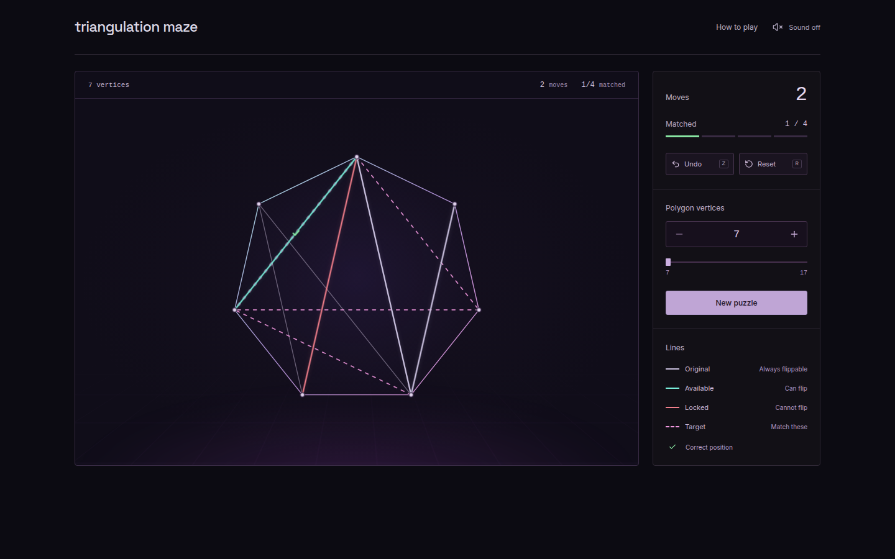

# Triangulation Maze

A polygon triangulation puzzle connected to the Four Color Theorem. Flip diagonals to match the target while neighboring edges change between available and locked.

I originally published this game as [_Triangulation Maze_](https://demonstrations.wolfram.com/TriangulationMaze/) on the **Wolfram Demonstrations Project in 2012**. This project is my rebuild of the game for the web.



One playable polygon contains the current triangulation, the dashed pink target, and a faint gray underlay of the starting diagonals. Flip the active diagonals until they match the target.

## Run locally

```sh
npm ci
npm run dev
```

Open the URL printed by Vite. `npm run build` writes the static site to `dist/`; `npm run preview` serves it. There is no backend, and no external requests during play.

## The rules

Choose a convex polygon with **7–17 vertices**. Each triangulation has `N − 3` internal diagonals.

1. **Flip a solid diagonal.** Its adjacent triangles form a quadrilateral. The selected diagonal is replaced by that quadrilateral's other diagonal.
2. **Watch the color changes.** A newly flipped diagonal is green and available. Non-original neighboring diagonals toggle between green (available) and red (locked). Locked diagonals cannot be flipped.
3. **Original edges stay available.** Faint gray lines keep the starting triangulation visible. Active diagonals on those positions keep the original white color and always remain flippable.
4. **Match the target.** Dashed pink lines show the target on the same polygon. A green check marks a matching diagonal, including correctly positioned red edges. Color only decides whether a line can be flipped, not whether it counts.

Starting and target triangulations share no diagonals, and no target diagonal is an immediate flip of a starting one, so solving takes at least `N − 2` moves and revisiting at least one diagonal. Every new puzzle is solvable. There is no timer or move limit.

## Controls

| Input                     | Action                                    |
| ------------------------- | ----------------------------------------- |
| Click or tap a solid line | Flip the diagonal                         |
| Hover a line              | Preview its quadrilateral and replacement |

Undo, reset, and the instructions are buttons in the control panel. The vertex count applies when you select **New puzzle**. Progress saves locally on this device, including undo history, and the game still works when storage is unavailable. Sound is optional and off by default. To open a specific puzzle, add `?n=9&seed=42` to the URL.

## Mathematical background

The puzzle is connected to the **Four Color Theorem** through signed diagonal flips. Shalom Eliahou conjectured that any two triangulations of the same polygon can be connected by a signable sequence of flips, and showed that this implies the Four Color Theorem. Sylvain Gravier and Charles Payan proved the converse in 2002, establishing the equivalence.

In the signed formulation, triangles carry `+` or `−` signs. A flip is permitted when its two adjacent triangles have equal signs, and the two replacement triangles receive the opposite sign. The available/locked states track whether those signs agree across a non-original diagonal; original diagonals stay unconstrained. The theorem guarantees a solution exists for any starting and target pair.

The **Details** section of the [original 2012 Demonstration](https://demonstrations.wolfram.com/TriangulationMaze/) includes my own proof sketch of that equivalence, relating common vertex 4-colorings of triangulations to paths of permitted flips in the associahedron. I developed it without knowing of the earlier work by Gravier and Payan.

- Shalom Eliahou, [_Signed Diagonal Flips and the Four Color Theorem_](https://doi.org/10.1006/eujc.1999.0312), **European Journal of Combinatorics 20**(7), 1999, pp. 641–647.
- Sylvain Gravier and Charles Payan, [_Flips Signés et Triangulations d'un Polygone_](https://doi.org/10.1006/eujc.2002.0601), **European Journal of Combinatorics 23**(7), 2002, pp. 817–821.
- Garry Bowlin and Matthew G. Brin, [_Coloring Planar Graphs via Colored Paths in the Associahedra_](https://doi.org/10.1142/S0218196713500276), **International Journal of Algebra and Computation 23**(6), 2013, pp. 1337–1418.
- Karin Baur, Diana Bergerova, Jenni Voon, and Lejie Xu, [_Flip graphs of coloured triangulations of convex polygons_](https://arxiv.org/abs/2402.06546), **arXiv:2402.06546 [math.CO]**, 2024.

## Structure

React, TypeScript, and Vite. A responsive SVG renders the playfield; CSS provides the grid, glow, and motion. Lucide supplies icons, and Inter / Space Grotesk are bundled locally through Fontsource.

```text
src/
  game/          Types, geometry, flip rules, and seeded puzzle generation
  components/    SVG board, diagonals, controls, header, instructions
  session.ts     Session transitions, save format, and browser storage
  useGame.ts     Game controller: state, feedback, and effects
  App.tsx        Layout and composition
  styles.css     Responsive layout and cascade layers
```

Pushing to `main` builds and publishes the site to GitHub Pages.

## License

[MIT](LICENSE) · © 2026 Fabian Lackner.
